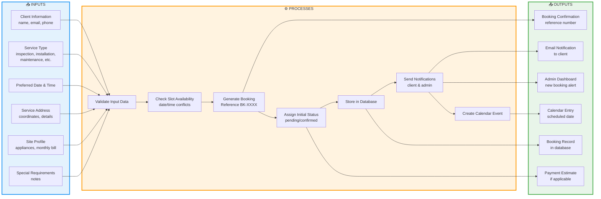
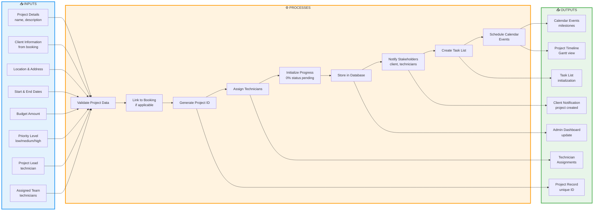
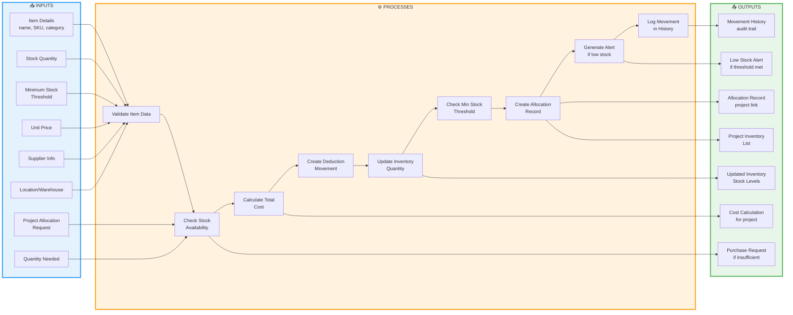
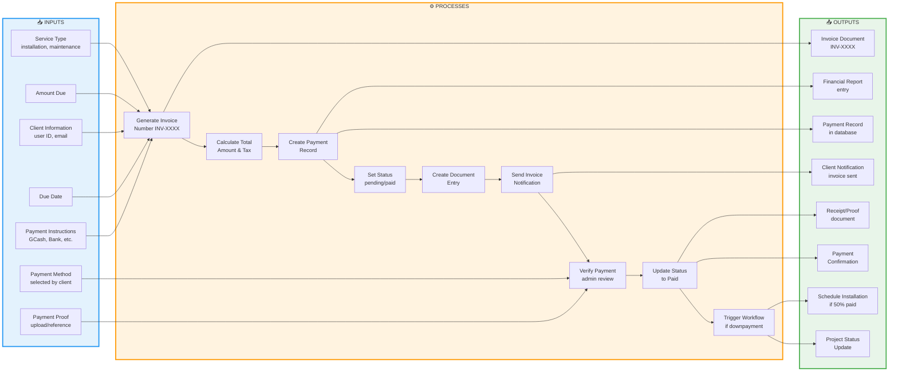
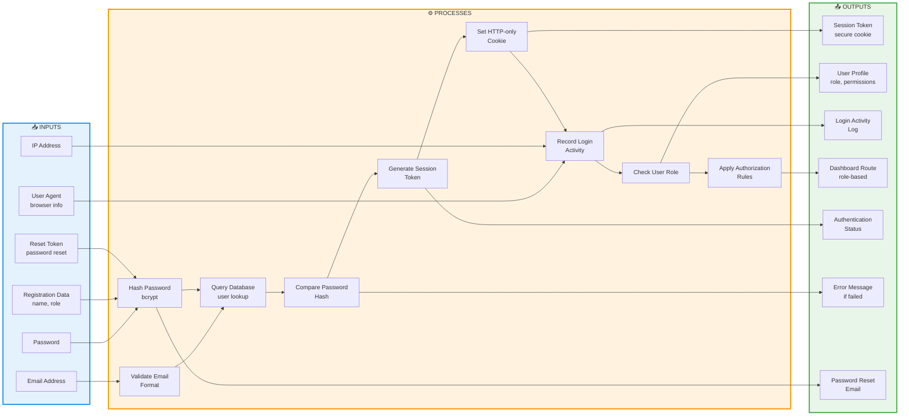
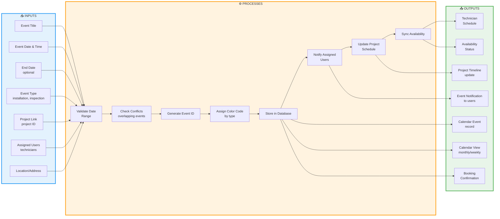
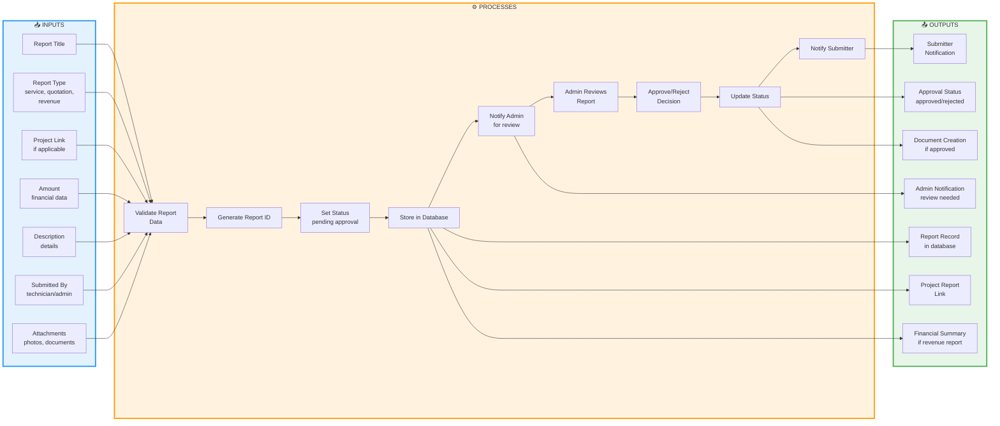
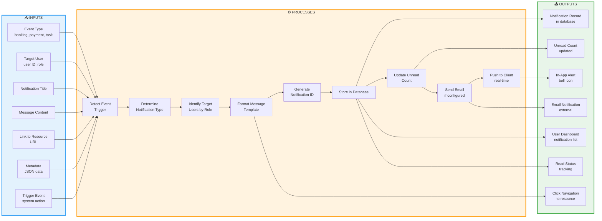
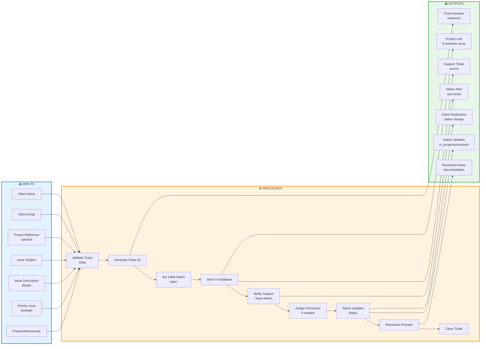
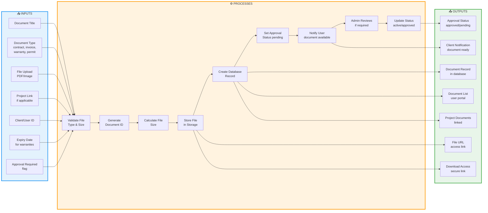

# GreenSky Solar System - Detailed IPO Diagrams

## Input-Process-Output Analysis for All Major Modules

---

## 1. Booking Management Module

---

## 2. Project Management Module

---

## 3. Inventory Management Module

---

## 4. Payment & Invoice Module

---

## 5. User Authentication Module

---

## 6. Calendar & Scheduling Module

---

## 7. Reporting Module

---

## 8. Notification System Module

---

## 9. After-Sales Support Module

---

## 10. Document Management Module

---

## Summary Table: All Modules IPO

| Module | Key Inputs | Key Processes | Key Outputs |
|--------|------------|---------------|-------------|
| **Booking** | Client info, Service type, Date/time, Address | Validate, Check slots, Generate ref, Notify | Confirmation, Notification, Calendar entry |
| **Project** | Project details, Client, Dates, Budget, Team | Create project, Assign team, Initialize tasks | Project record, Assignments, Timeline |
| **Inventory** | Item details, Stock qty, Min threshold, Project allocation | Check stock, Allocate, Update quantity, Alert | Stock update, Allocation record, Alerts |
| **Payment** | Amount, Client, Due date, Method | Generate invoice, Verify payment, Update status | Invoice, Receipt, Status update, Trigger |
| **Authentication** | Email, Password, IP, User agent | Hash password, Validate, Create session | Session token, User profile, Login log |
| **Calendar** | Event details, Date, Type, Users | Validate, Check conflicts, Store, Notify | Calendar event, Schedule, Notifications |
| **Reports** | Title, Type, Project, Amount | Validate, Generate ID, Admin review, Approve | Report record, Approval status, Document |
| **Notifications** | Event type, Target user, Message | Detect event, Format, Store, Push, Email | Notification record, Alert, Email |
| **After-Sales** | Client, Issue, Description | Create ticket, Assign, Update status, Resolve | Ticket record, Status updates, Resolution |
| **Documents** | Title, Type, File, Project | Upload, Store, Create record, Approve | Document record, File URL, Access link |

---

**Document Version:** 1.0  
**Last Updated:** March 4, 2026  
**Purpose:** Detailed Input-Process-Output analysis for GreenSky Solar capstone documentation
