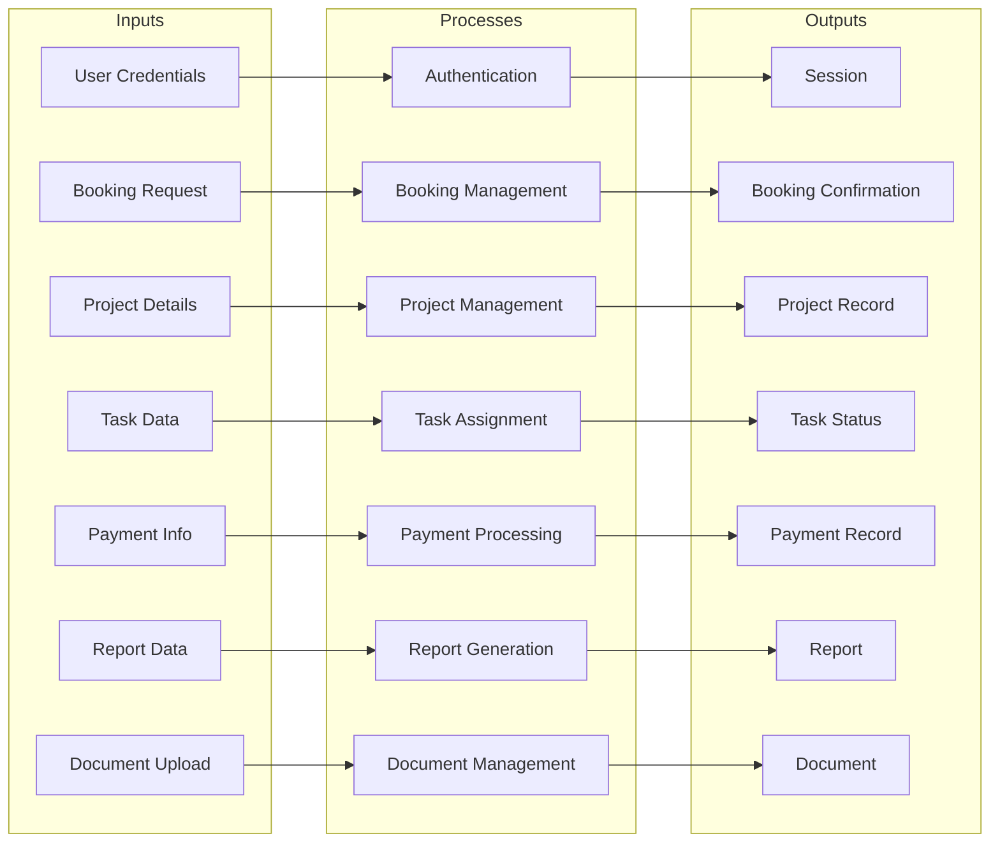
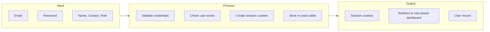
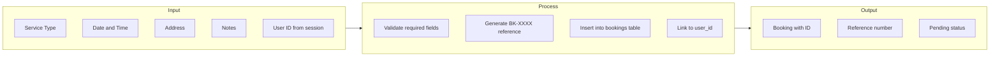
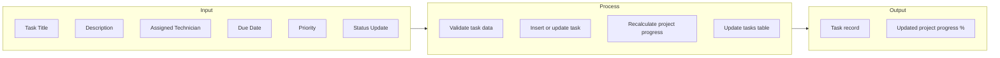
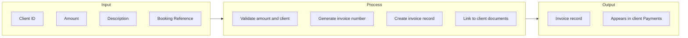
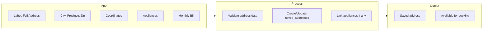
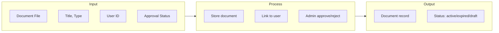
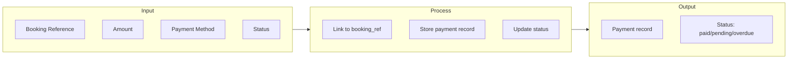

# GreenSky Solar - IPO (Input-Process-Output) Diagram

This document describes the main system processes using IPO notation: **Input** → **Process** → **Output**.

---

## System Overview IPO

---

## 1. Authentication (Login/Register)

| Input | Process | Output |
|-------|---------|--------|
| Email, password | Validate, check DB, hash verify | Session, redirect |
| Name, email, password, contact number | Create user, hash password, insert | User record, redirect to login |

---

## 2. Booking Creation

| Input | Process | Output |
|-------|---------|--------|
| serviceType, date, time, address, notes, userId | Validate, generate ref, insert booking | Booking (id, referenceNo, status: pending) |

---

## 3. Project Creation

```mermaid
flowchart LR
    subgraph Input
        direction TB
        A1[Project Name]
        A2[Client or Booking ID]
        A3[Location]
        A4[Start/End Date]
        A5[Budget, Priority]
        A6[Project Lead]
        A7[Description]
    end

    subgraph Process
        direction TB
        B1[Validate required fields]
        B2[Optionally create solar booking]
        B3[Generate proj-XXX ID]
        B4[Insert project]
        B5[Link booking_id if applicable]
        B6[Assign project_technicians]
    end

    subgraph Output
        direction TB
        C1[Project record]
        C2[Linked booking if new]
        C3[Task list empty]
    end

    Input --> Process --> Output
```

| Input | Process | Output |
|-------|---------|--------|
| name, client, location, dates, budget, priority, projectLead, bookingId? | Validate, create booking if needed, insert project, assign technicians | Project with id, status: pending |

---

## 4. Task Management

| Input | Process | Output |
|-------|---------|--------|
| title, description, assignedTo, dueDate, priority | Insert task, recalc progress | Task id, project progress updated |
| taskId, status | Update task status | Updated task, progress % |

---

## 5. Report Submission

```mermaid
flowchart LR
    subgraph Input
        direction TB
        A1[Report Type]
        A2[Title, Description]
        A3[Project ID]
        A4[Amount]
        A5[Submitted By]
    end

    subgraph Process
        direction TB
        B1[Validate report data]
        B2[Generate report ID]
        B3[Insert into reports table]
        B4[Admin approval workflow]
    end

    subgraph Output
        direction TB
        C1[Report record]
        C2[Status: pending]
        C3[Approval/Rejection]
    end

    Input --> Process --> Output
```

| Input | Process | Output |
|-------|---------|--------|
| type, title, description, projectId, amount | Insert report, await approval | Report (status: pending/approved/rejected) |

---

## 6. Invoice Creation

| Input | Process | Output |
|-------|---------|--------|
| clientId, amount, description, bookingRef | Validate, generate invoice no, create | Invoice, visible in client portal |

---

## 7. Address Management

| Input | Process | Output |
|-------|---------|--------|
| label, fullAddress, city, province, zipCode, appliances, monthlyBill | Validate, insert address + appliances | SavedAddress for booking selection |

---

## 8. Document Management

---

## 9. Payment Processing

---

## Summary Table

| Module | Key Inputs | Key Outputs |
|--------|------------|-------------|
| Auth | email, password | session, user |
| Booking | serviceType, date, time, address | Booking (BK-XXXX) |
| Project | name, client, location, dates, budget | Project (proj-XXX) |
| Task | title, assignedTo, dueDate | Task, progress % |
| Report | type, title, projectId | Report |
| Invoice | clientId, amount | Invoice |
| Address | address, appliances | SavedAddress |
| Document | file, type | Document |
| Payment | bookingRef, amount, method | Payment |
