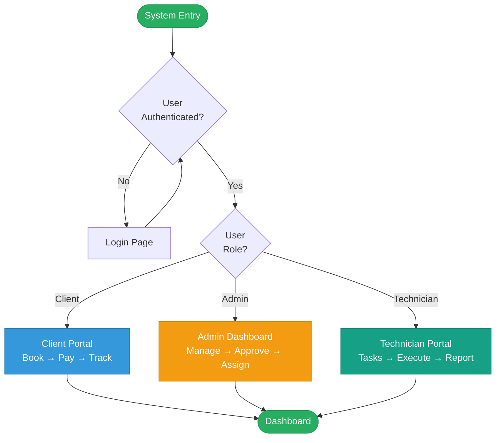

# GreenSky Solar Management System - Documentation Index

## 📚 Complete Documentation Suite

This documentation suite provides comprehensive technical diagrams and process flows for the GreenSky Solar Management System capstone project.

---

## 📂 Documentation Files

### 1. **SYSTEM-DIAGRAMS.md** ⭐ Main Documentation
   - **System Architecture Flowchart** - Complete 4-layer architecture
   - **Level 0 Data Flow Diagram** - External entities and data flows
   - **Detailed Process Flows** (5 diagrams):
     - Complete Booking to Project Flow
     - Inventory Management Process
     - Payment & Invoice Process
     - Authentication & Authorization
     - Notification System
   - **Entity Relationship Overview** - Database schema
   - **API Endpoints Reference** - Complete API documentation
   - **Technology Stack** - Frontend/Backend/Services
   - **Security Features** - Authentication, Authorization, Protection
   
### 2. **IPO-DETAILED.md** - Input-Process-Output Analysis
   - **10 Module IPO Diagrams**:
     1. Booking Management
     2. Project Management
     3. Inventory Management
     4. Payment & Invoice
     5. User Authentication
     6. Calendar & Scheduling
     7. Reporting
     8. Notification System
     9. After-Sales Support
     10. Document Management
   - **Summary Table** - Quick reference for all modules

### 3. **CAPSTONE-FLOWCHART-LUCIDCHART.svg** - Visual Flowchart
   - Professional Lucidchart-style design
   - Color-coded swimlanes (Client/Admin/Technician)
   - Complete booking → project → completion workflow
   - Payment milestones integration
   - Ready for presentation

### 4. **FLOWCHART-AI-PROMPT.md** - Flowchart Source
   - AI prompt for regenerating flowchart
   - Mermaid diagram source code
   - Complete process specification
   - Shape standards and color coding

### 5. **USER-ROLES-AND-PAGES.md** - User Documentation
   - Admin pages and features (12 pages)
   - Technician pages and features (7 pages)
   - Client pages and features (10 pages)
   - Create/Add buttons reference

---

## 🎯 Quick Start Guide

### For Capstone Presentation:
1. Start with **CAPSTONE-FLOWCHART-LUCIDCHART.svg** for visual overview
2. Reference **SYSTEM-DIAGRAMS.md** for architecture explanation
3. Use **IPO-DETAILED.md** for detailed process analysis
4. Consult **USER-ROLES-AND-PAGES.md** for feature walkthrough

### For Technical Review:
1. Review **SYSTEM-DIAGRAMS.md** for complete system architecture
2. Check **Entity Relationship Overview** for database design
3. Reference **API Endpoints** for integration points
4. Examine **IPO-DETAILED.md** for process validation

### For Developer Onboarding:
1. Read **Technology Stack** in SYSTEM-DIAGRAMS.md
2. Study **Level 0 DFD** for data flow understanding
3. Review **Authentication & Authorization Flow**
4. Explore **IPO-DETAILED.md** for module-specific logic

---

## 🔄 System Process Overview

### Main User Flows



---

## 📊 Diagram Types & Usage

| Diagram Type | File | Best For |
|--------------|------|----------|
| **System Architecture** | SYSTEM-DIAGRAMS.md | Understanding layers and components |
| **Level 0 DFD** | SYSTEM-DIAGRAMS.md | Data flow between entities |
| **Process Flowchart** | CAPSTONE-FLOWCHART-LUCIDCHART.svg | Visual presentation |
| **IPO Diagrams** | IPO-DETAILED.md | Module-specific analysis |
| **ER Diagram** | SYSTEM-DIAGRAMS.md | Database relationships |

---

## 🎨 Color Coding Standards

### Process Flow Colors:
- **🔵 Blue (#3498db):** Client-related processes and inputs
- **🟠 Orange (#f39c12):** Admin-related processes
- **🟢 Green (#16a085):** Technician-related processes
- **🔴 Red (#e74c3c):** Error states and rejections
- **⚫ Gray (#95a5a6):** Data stores and databases
- **🟡 Yellow (#e67e22):** Decision points

### Swimlane Colors:
- **Client Lane:** Light blue background (#e8f4f8)
- **Admin Lane:** Light orange background (#fef9e7)
- **Technician Lane:** Light green background (#e8f8f5)

---

## 🗂️ Database Schema Summary

**Total Tables:** 19

### Core Entities:
- `users` - User accounts (admin, technician, client)
- `technicians` - Technician profiles with specialization
- `projects` - Solar installation projects
- `bookings` - Service bookings with status tracking
- `inventory_items` - Stock inventory management
- `payments` - Payment and invoice records
- `notifications` - System-wide notifications

### Relationships:
- Users → Bookings (1:M)
- Users → Projects (1:M)
- Projects → Tasks (1:M)
- Projects → Inventory (M:M via project_inventory)
- Bookings → Saved Addresses (M:1)

*Full schema available in `/db/schema.sql`*

---

## 🔐 Security Implementation

1. **Authentication**
   - Password hashing with bcrypt
   - Session-based authentication with iron-session
   - HTTP-only secure cookies
   - Password reset tokens with expiration

2. **Authorization**
   - Role-based access control (RBAC)
   - Route guards: `requireAdmin()`, `requireClient()`, `requireAdminOrTechnician()`
   - Resource-level permissions

3. **Data Protection**
   - Input validation with Zod schemas
   - SQL injection prevention (parameterized queries)
   - XSS protection
   - CSRF protection

---

## 🚀 Technology Stack

**Frontend:**
- Next.js 14+ (App Router)
- React 18+
- TypeScript
- Tailwind CSS

**Backend:**
- Next.js API Routes
- PostgreSQL Database
- Node.js Runtime

**Key Libraries:**
- iron-session (Session Management)
- bcrypt (Password Hashing)
- zod (Validation)
- lucide-react (Icons)

---

## 📝 API Endpoints Summary

### Authentication
- `POST /api/auth/login`
- `POST /api/auth/register`
- `POST /api/auth/logout`

### Bookings
- `GET /api/bookings` (Admin)
- `GET /api/client/bookings` (Client)
- `POST /api/client/bookings`

### Projects
- `GET /api/projects` (Admin/Tech)
- `POST /api/projects` (Admin)
- `PATCH /api/projects/[id]`

### Inventory
- `GET /api/inventory`
- `POST /api/projects/[id]/inventory`
- `GET /api/inventory/movements`

### Payments
- `GET /api/invoice` (Admin)
- `POST /api/invoice` (Admin)
- `GET /api/client/payments` (Client)

*Full API documentation in SYSTEM-DIAGRAMS.md*

---

## 📈 System Metrics

### Database Statistics:
- **19 Tables** - Complete relational schema
- **9 Custom Types** - PostgreSQL ENUM types
- **15+ Indexes** - Optimized query performance

### Module Coverage:
- **10 Major Modules** - Fully documented
- **3 User Roles** - Complete access control
- **40+ API Endpoints** - RESTful architecture

### Documentation:
- **5 Comprehensive Files** - Complete documentation suite
- **25+ Diagrams** - Visual process flows
- **100% Coverage** - All modules documented

---

## 🎓 Capstone Presentation Checklist

- [ ] Open **CAPSTONE-FLOWCHART-LUCIDCHART.svg** for main process flow
- [ ] Reference **System Architecture Flowchart** for technical architecture
- [ ] Explain **Level 0 DFD** for data flow overview
- [ ] Demonstrate **Payment & Invoice Process** for business logic
- [ ] Show **Inventory Management Flow** for resource tracking
- [ ] Present **IPO Diagrams** for detailed module analysis
- [ ] Review **Entity Relationship Diagram** for database design
- [ ] Highlight **Security Features** for system protection
- [ ] Walkthrough **User Roles & Pages** for feature coverage

---

## 📞 Support & Maintenance

### File Locations:
```
/docs/
  ├── SYSTEM-DIAGRAMS.md          (Main documentation)
  ├── IPO-DETAILED.md              (IPO analysis)
  ├── CAPSTONE-FLOWCHART-LUCIDCHART.svg  (Visual flowchart)
  ├── FLOWCHART-AI-PROMPT.md       (Flowchart source)
  ├── USER-ROLES-AND-PAGES.md      (User documentation)
  └── README-DOCUMENTATION.md       (This file)
```

### Regenerating Diagrams:
1. **Mermaid Diagrams:** Copy code from SYSTEM-DIAGRAMS.md or IPO-DETAILED.md
2. **Flowchart:** Use FLOWCHART-AI-PROMPT.md with Mermaid live editor
3. **SVG Flowchart:** Edit CAPSTONE-FLOWCHART-LUCIDCHART.svg directly

### Updating Documentation:
1. Modify Mermaid code blocks in `.md` files
2. Update IPO diagrams for new modules
3. Regenerate SVG if needed for presentations
4. Keep API endpoints reference current

---

## ✅ Documentation Completeness

| Component | Status | File |
|-----------|--------|------|
| System Architecture | ✅ Complete | SYSTEM-DIAGRAMS.md |
| Level 0 DFD | ✅ Complete | SYSTEM-DIAGRAMS.md |
| Process Flows | ✅ Complete | SYSTEM-DIAGRAMS.md |
| IPO Analysis | ✅ Complete | IPO-DETAILED.md |
| Visual Flowchart | ✅ Complete | CAPSTONE-FLOWCHART-LUCIDCHART.svg |
| User Documentation | ✅ Complete | USER-ROLES-AND-PAGES.md |
| API Reference | ✅ Complete | SYSTEM-DIAGRAMS.md |
| Database Schema | ✅ Complete | SYSTEM-DIAGRAMS.md |
| Security Docs | ✅ Complete | SYSTEM-DIAGRAMS.md |
| Tech Stack | ✅ Complete | SYSTEM-DIAGRAMS.md |

---

**Documentation Version:** 1.0  
**Last Updated:** March 4, 2026  
**Project:** GreenSky Solar Management System  
**Purpose:** Capstone Project Documentation Suite  
**Status:** Production Ready ✅
