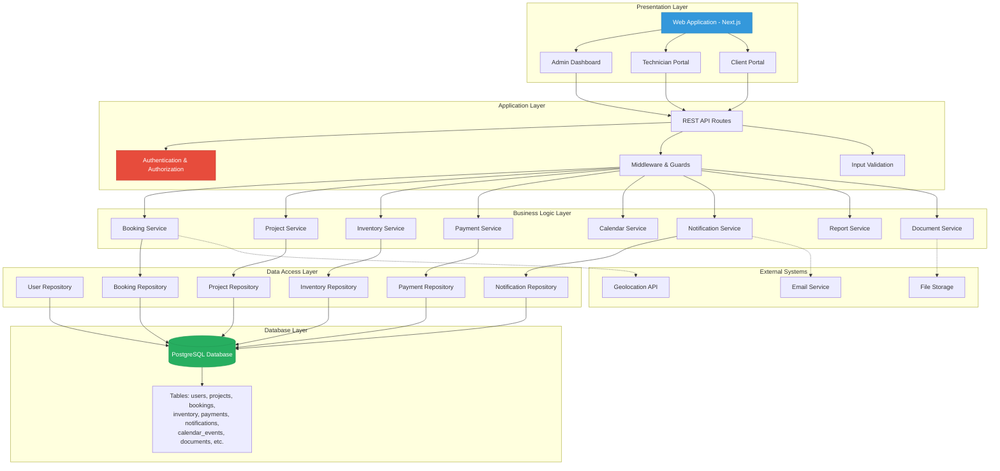
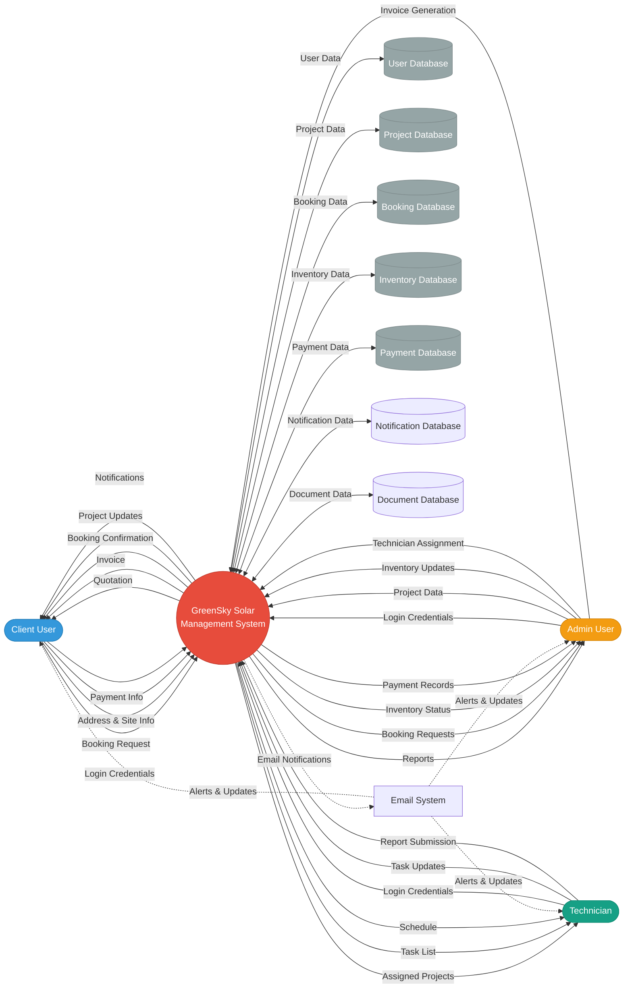
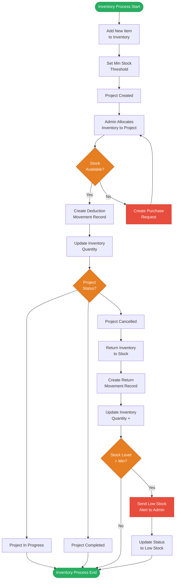
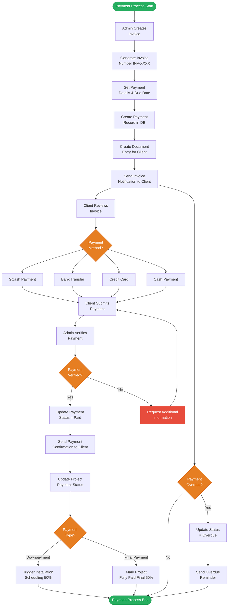
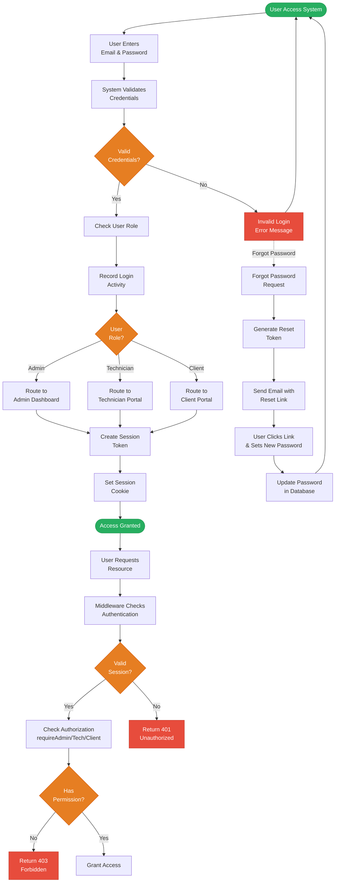
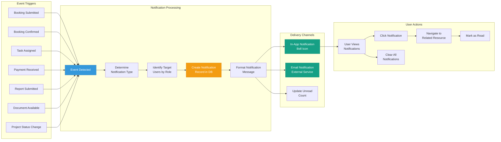
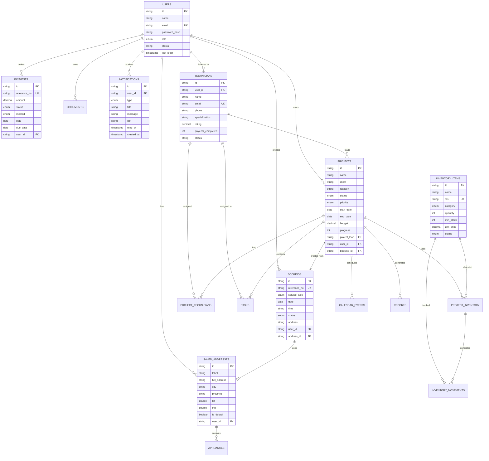

# GreenSky Solar Management System - Technical Documentation

## Table of Contents
1. [System Overview](#system-overview)
2. [System Architecture Flowchart](#system-architecture-flowchart)
3. [Level 0 Data Flow Diagram](#level-0-data-flow-diagram)
4. [Detailed Process Flows](#detailed-process-flows)
5. [Entity Relationship Overview](#entity-relationship-overview)

---

## System Overview

**System Name:** GreenSky Solar Management System  
**Purpose:** End-to-end solar installation management platform  
**User Roles:** Admin, Technician, Client  
**Core Modules:** Authentication, Bookings, Projects, Inventory, Payments, Calendar, Reports, After-Sales

---

## System Architecture Flowchart

---

## Level 0 Data Flow Diagram

---

## Detailed Process Flows

### 1. Complete Booking to Project Completion Flow

```mermaid
flowchart LR
    subgraph Client["CLIENT LANE"]
        C0([START])
        C1[/Create Address<br/>& Site Profile<br/>appliances, Meralco bill/]
        C2[/Submit Booking<br/>select date, time, service/]
        C3[Reselect<br/>Date/Time]
        C4[/Review<br/>Quotation/]
        C5{Agree to<br/>Quotation?}
        C6[/Pay 50%<br/>Downpayment/]
        C7[/Pay Final<br/>50% Payment/]
        C8([END])
    end

    subgraph Admin["ADMIN LANE"]
        A1[Review Booking<br/>/bookings page]
        D1{Slot<br/>Available?}
        A2[Set Booking<br/>= Confirmed]
        A3[Create Project<br/>/projects page]
        A12[/Prepare &<br/>Send Quotation/]
        A13[Record 50%<br/>Downpayment]
        A16[Schedule Solar<br/>Installation<br/>/calendar]
        A4[Assign<br/>Technician]
        A6[Check<br/>Inventory]
        D3{Stock<br/>Sufficient?}
        A8[Create Purchase<br/>Request]
        A14[Generate<br/>Final Invoice]
        A15[/Issue Final<br/>50% Payment/]
        A11[/Send<br/>Notification/]
    end

    subgraph Technician["TECHNICIAN LANE"]
        D2{Technician<br/>Available?}
        T1[Receive<br/>Project]
        T2[Execute<br/>Installation]
        T3[Submit<br/>Completion Report]
        D4{Project<br/>Complete?}
        T4[Rework/Fix<br/>Issues]
    end

    %% Flow connections
    C0 --> C1
    C1 --> C2
    C2 --> A1
    A1 --> D1
    D1 -->|No| C3
    C3 --> C2
    D1 -->|Yes| A2
    A2 --> A3
    A3 --> A12
    A12 --> C4
    C4 --> C5
    C5 -->|No| A12
    C5 -->|Yes| C6
    C6 --> A13
    A13 --> A16
    A16 --> A4
    A4 --> D2
    D2 -->|No| A4
    D2 -->|Yes| A6
    A6 --> D3
    D3 -->|No| A8
    A8 --> A6
    D3 -->|Yes| T1
    T1 --> T2
    T2 --> T3
    T3 --> D4
    D4 -->|No| T4
    T4 --> T2
    D4 -->|Yes| A14
    A14 --> A15
    A15 --> C7
    C7 --> A11
    A11 --> C8

    style C0 fill:#27ae60,stroke:#229954,color:#fff
    style C8 fill:#27ae60,stroke:#229954,color:#fff
    style C1 fill:#3498db,stroke:#2980b9,color:#fff
    style C2 fill:#3498db,stroke:#2980b9,color:#fff
    style C4 fill:#3498db,stroke:#2980b9,color:#fff
    style C6 fill:#3498db,stroke:#2980b9,color:#fff
    style C7 fill:#3498db,stroke:#2980b9,color:#fff
    style C3 fill:#e74c3c,stroke:#c0392b,color:#fff
    style C5 fill:#e67e22,stroke:#d35400,color:#fff
    style D1 fill:#e67e22,stroke:#d35400,color:#fff
    style D2 fill:#16a085,stroke:#138d75,color:#fff
    style D3 fill:#e67e22,stroke:#d35400,color:#fff
    style D4 fill:#16a085,stroke:#138d75,color:#fff
    style A12 fill:#f39c12,stroke:#d68910,color:#fff
    style A15 fill:#f39c12,stroke:#d68910,color:#fff
    style A11 fill:#f39c12,stroke:#d68910,color:#fff
```

### 2. Inventory Management Process Flow

### 3. Payment & Invoice Process Flow

### 4. Authentication & Authorization Flow

### 5. Notification System Flow

---

## Entity Relationship Overview

---

## API Endpoints Reference

### Authentication
- `POST /api/auth/login` - User login
- `POST /api/auth/register` - User registration
- `POST /api/auth/logout` - User logout
- `POST /api/auth/forgot-password` - Request password reset
- `POST /api/auth/reset-password` - Reset password with token

### Bookings
- `GET /api/bookings` - List all bookings (Admin)
- `GET /api/client/bookings` - List client bookings
- `POST /api/client/bookings` - Create new booking
- `PATCH /api/bookings/[id]` - Update booking status
- `DELETE /api/bookings/[id]` - Cancel booking

### Projects
- `GET /api/projects` - List projects (Admin/Technician)
- `GET /api/client/projects` - List client projects
- `POST /api/projects` - Create project (Admin)
- `PATCH /api/projects/[id]` - Update project
- `DELETE /api/projects/[id]` - Delete project
- `GET /api/projects/[id]` - Get project details

### Inventory
- `GET /api/inventory` - List inventory items
- `POST /api/inventory` - Add inventory item
- `PATCH /api/inventory/[id]` - Update inventory
- `POST /api/projects/[id]/inventory` - Allocate inventory to project
- `DELETE /api/projects/[id]/inventory/[itemId]` - Remove allocation
- `GET /api/inventory/movements` - List inventory movements

### Payments & Invoices
- `GET /api/invoice` - List invoices (Admin)
- `POST /api/invoice` - Create invoice (Admin)
- `GET /api/client/payments` - List client payments
- `PATCH /api/client/payments/[id]` - Update payment status

### Calendar
- `GET /api/calendar/events` - List calendar events
- `POST /api/calendar/events` - Create calendar event
- `PATCH /api/calendar/events/[id]` - Update event
- `DELETE /api/calendar/events/[id]` - Delete event

### Notifications
- `GET /api/notifications` - List notifications
- `GET /api/notifications/unread-count` - Get unread count
- `PATCH /api/notifications/[id]/read` - Mark notification as read
- `PATCH /api/notifications/mark-all-read` - Mark all as read
- `DELETE /api/notifications/clear-all` - Clear all notifications

### Users & Technicians
- `GET /api/users` - List users (Admin)
- `POST /api/users` - Create user (Admin)
- `PATCH /api/users/[id]` - Update user
- `DELETE /api/users/[id]` - Delete user
- `GET /api/technicians` - List technicians
- `POST /api/technicians` - Create technician

### Reports
- `GET /api/reports` - List reports (Admin)
- `POST /api/reports` - Submit report
- `PATCH /api/reports/[id]` - Update report status
- `DELETE /api/reports/[id]` - Delete report

### After-Sales
- `GET /api/after-sales/tickets` - List support tickets
- `POST /api/after-sales/tickets` - Create support ticket
- `PATCH /api/after-sales/tickets/[id]` - Update ticket status

### Documents
- `GET /api/client/documents` - List client documents
- `GET /api/client/warranty` - List warranty information

### Profile
- `GET /api/profile` - Get user profile
- `PATCH /api/profile` - Update profile
- `GET /api/profile/login-activity` - Get login history

---

## Technology Stack

**Frontend:**
- Next.js 14+ (App Router)
- React 18+
- TypeScript
- Tailwind CSS
- Lucide Icons

**Backend:**
- Next.js API Routes
- Node.js Runtime
- PostgreSQL Database
- Server-Side Authentication

**Key Libraries:**
- Iron-session (Session Management)
- Bcrypt (Password Hashing)
- Date-fns (Date Utilities)
- Zod (Validation)

**External Services:**
- Email Service (Password Reset, Notifications)
- Geolocation API (Address Mapping)
- File Storage (Document Management)

---

## Security Features

1. **Authentication**
   - Password hashing with bcrypt
   - Session-based authentication
   - Secure HTTP-only cookies
   - Password reset with time-limited tokens

2. **Authorization**
   - Role-based access control (Admin, Technician, Client)
   - Route guards (requireAdmin, requireClient, requireAdminOrTechnician)
   - Resource-level permissions

3. **Data Protection**
   - Input validation with Zod schemas
   - SQL injection prevention (parameterized queries)
   - XSS protection
   - CSRF protection

4. **Audit & Monitoring**
   - Login activity tracking
   - Audit log for critical operations
   - Idempotency keys for payment operations

---

## Database Schema Summary

**Total Tables:** 19

**Core Tables:**
- `users` - User accounts (admin, technician, client)
- `technicians` - Technician profiles
- `clients` - Client information
- `projects` - Solar installation projects
- `bookings` - Service bookings
- `inventory_items` - Stock inventory
- `payments` - Payment records
- `saved_addresses` - Client addresses
- `notifications` - System notifications

**Relationship Tables:**
- `project_technicians` - Many-to-many project assignments
- `project_inventory` - Inventory allocation to projects
- `inventory_movements` - Inventory transaction history
- `appliances` - Appliances per address

**Supporting Tables:**
- `tasks` - Project tasks
- `calendar_events` - Scheduled events
- `reports` - Service reports
- `documents` - Document management
- `support_tickets` - After-sales support
- `audit_log` - System audit trail
- `idempotency_keys` - Duplicate request prevention

---

## Color Legend for Diagrams

- **Blue (#3498db):** Client-related processes/inputs
- **Orange (#f39c12):** Admin-related processes
- **Green (#16a085):** Technician-related processes
- **Red (#e74c3c):** Error states/rejections
- **Gray (#95a5a6):** Data stores/databases
- **Yellow (#e67e22):** Decision points

---

**Document Version:** 1.0  
**Last Updated:** March 4, 2026  
**Generated For:** GreenSky Solar Capstone Project
